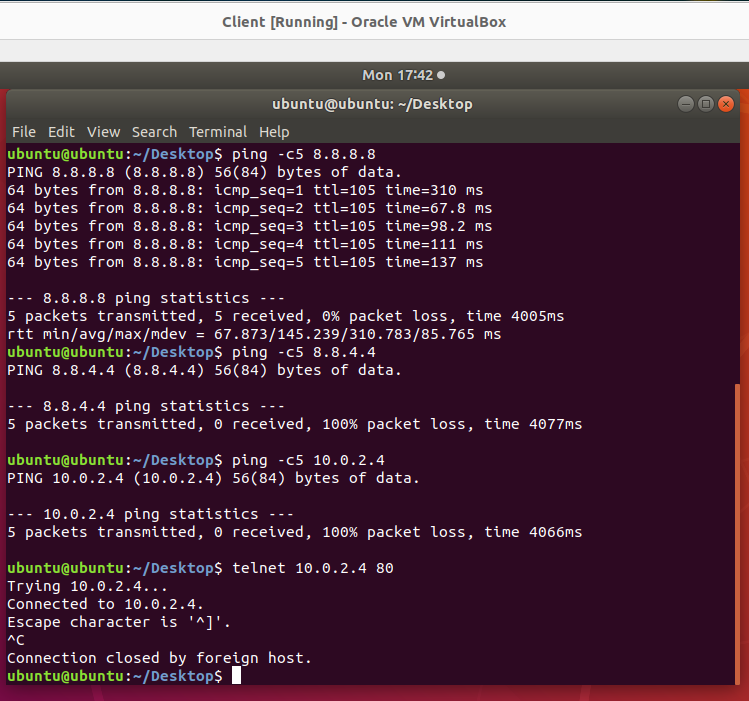
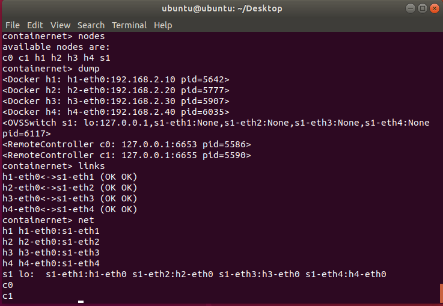
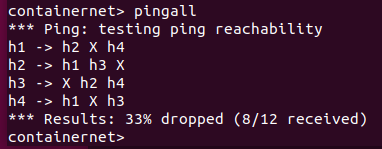
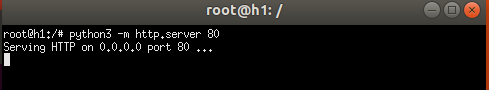
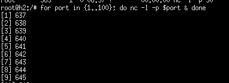
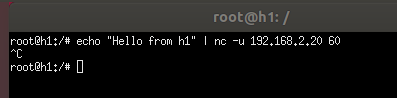
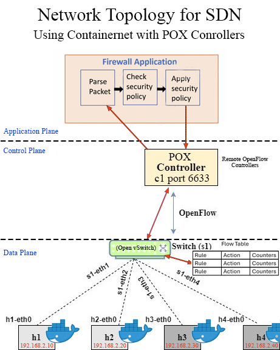
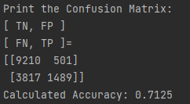
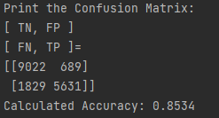
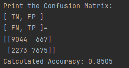

# Advanced Network Cybersecurity Projects

## Cybersecurity Projects Overview
This repository contains four projects demonstrating advanced network security techniques. Each project is documented in a separate section of this README:

- **Project 1 – Packet Filter Firewall:** Configuring a stateless firewall using `iptables` in a simulated network.
- **Project 2 – SDN-Based Stateless Firewall:** Implementing Layer 2 and Layer 3 firewall rules with POX controllers in a Containernet environment.
- **Project 3 – SDN-Based DoS Attack and Mitigation:** Simulating TCP SYN flood attacks and dynamically mitigating them with OpenFlow rules.
- **Project 4 – ML-Based Anomaly Detection Solutions:** Training a Feedforward Neural Network to detect network intrusions using the NSL-KDD dataset.

Each section includes an overview, key features, instructions to build and run, screenshots, and notes.

### 📽️ **Demonstration Video**
[🎬 Watch on YouTube](https://youtu.be/ufA0IDbo85U)

---

## Project 1 – Packet Filter Firewall

### Project 1 Overview
This project demonstrates configuring a stateless packet filter firewall using `iptables` in a simulated network environment with two subnets and a gateway server. The environment uses VirtualBox VMs running Ubuntu, with NAT and packet filtering to control traffic flow between an internal client subnet and the external internet.

---

### Key Features
- Dual-subnet topology configured via VirtualBox
- Dynamic IP assignment with DHCP
- Apache HTTP server configured on the gateway
- Custom `iptables` script to:
  - Enable IP forwarding
  - Enforce default DROP policies
  - Whitelist specific ICMP and HTTP flows
  - Apply NAT masquerading
  - Log dropped packets
- Client script to reset the default gateway to enforce routing through the firewall

---

### Screenshots

**Client Default Gateway**


**Client No Web Access**


**Client Ping and Telnet Evaluation**



**Nmap TCP Scan**


**Server Iptables Dump**


---

### Technologies Used
- Ubuntu 20.04
- VirtualBox 7.x
- iptables
- Apache HTTP server
- Wireshark, tcpdump, nmap, ping, traceroute

---

### How to Build and Run

1. **Create Virtual Machines**
   - Set up 2 VMs (Client and Gateway) with Ubuntu 20.04.
   - Attach network adapters to two NAT networks:
     - `10.0.2.0/24`
     - `10.0.1.0/24`

2. **Install Software**

       sudo apt update
       sudo apt install apache2 iptables tcpdump nmap

3. **Enable IP Forwarding**

       sudo sysctl -w net.ipv4.ip_forward=1

4. **Run iptables script on Gateway**

       sudo chmod +x chad-iptables.sh
       sudo ./chad-iptables.sh

5. **Run client gateway reset script**

       sudo chmod +x flush-gateway.sh
       sudo ./flush-gateway.sh

6. **Verify connectivity**
   - Test ping, telnet, nmap scans per project report.

---
---

## Project 2 – SDN-Based Stateless Firewall

### Project 2 Overview
This project demonstrates an SDN-based stateless firewall using Containernet and Mininet, integrating Docker containers, Open vSwitch (OVS), and two remote POX controllers. The architecture separates concerns into three planes:
- **Data Plane**: OVS switch forwarding packets
- **Control Plane**: Two POX controllers enforcing policies
- **Application Plane**: Firewall rule modules (Layer 2 and Layer 3)

The setup uses static IP and MAC assignments and configures both Layer 2 (MAC-level) and Layer 3 (IP/port-level) firewall rules.

---

### Key Features
- Custom Containernet topology with:
  - 4 Docker container hosts
  - 1 Open vSwitch
  - 2 POX controllers
- Dynamic OpenFlow rule enforcement
- L2 and L3 firewall policies:
  - ICMP, TCP, UDP blocking
  - MAC address filtering
- Evaluation scenarios demonstrating rule enforcement

---

### Screenshots

**Containernet Topology**



**Firewall Rules Example**


**OVS Rule Tables**


**Evaluation – Blocking ICMP (Eval3)**



**Evaluation – Blocking HTTP (Eval5)**



**Evaluation – Blocking TCP (Eval7)**



**Evaluation – Blocking UDP (Eval8)**



---

### Technologies Used
- Ubuntu 20.04
- Mininet & Containernet
- Open vSwitch
- POX Controller (l2config, l3config)
- Docker

---

### How to Build and Run

1. **Install Dependencies**
   - Use the provided `.vdi` image pre-configured with Mininet, OVS, POX, and Docker.

2. **Update Software**

    ```bash
    sudo apt update
    sudo apt upgrade
    sudo pip3 install --upgrade pip
    sudo pip3 install docker
    ```

3. **Launch POX Controllers**

   - **Terminal 1:**

        ```bash
        cd ~/pox
        ./pox.py log.level --DEBUG l2firewall --config l2firewall.config --verbose --port=6653
        ```

   - **Terminal 2:**

        ```bash
        cd ~/pox
        ./pox.py log.level --DEBUG l3firewall --config l3firewall.config --verbose --port=6655
        ```

4. **Start Containernet Topology**

    ```bash
    sudo mn -c
    sudo python3 containernet-create-topology.py
    ```

5. **Run Evaluations**
   - Use `ping`, `telnet`, `nmap`, etc., to verify firewall enforcement.

---
---

## Project 3 – SDN-Based DoS Attack and Mitigation

### Project 3 Overview
This project demonstrates a simulated TCP SYN flood denial-of-service (DoS) attack in a Software-Defined Networking (SDN) environment using Containernet, Mininet, Open vSwitch, and a POX controller. The project implements dynamic mitigation strategies including MAC and IP address blocking by injecting OpenFlow rules through the controller when spoofed traffic is detected.

---

### Key Features
- **Containernet Topology:**
  - Four Docker container hosts with static IPs and MAC addresses
  - Single OVS switch managed by a POX controller
- **L3Firewall.py Enhancements:**
  - Dynamic detection of IP spoofing
  - Automatic blocking of malicious MAC addresses
  - Bonus: IP blocking when MAC spoofing is detected
- **Evaluation Scenarios:**
  - TCP SYN flood with spoofed IPs and MACs
  - Observing real-time mitigation in OVS flow tables and POX logs
  - Verifying that unaffected hosts maintain connectivity

---

### Screenshots

**Containernet Topology**


**POX Controller – Using Switch Application**



**Evaluation – DoS Attack and Mitigation (TCP SYN Flood)**


**Evaluation – IP Spoofing Blocked**


**Evaluation – MAC Spoofing Blocked**


---

### Technologies Used
- Ubuntu 20.04
- Mininet & Containernet
- Open vSwitch
- POX Controller
- Docker

---

### How to Build and Run

1. **Install Dependencies**
   - Use the `.vdi` image pre-configured with Mininet, OVS, POX, and Docker.

2. **Update Software**

    ```bash
    sudo apt update
    sudo apt upgrade
    sudo pip3 install --upgrade pip
    sudo pip3 install docker
    ```

3. **Launch POX Controller**

    ```bash
    cd ~/pox
    ./pox.py log.level --DEBUG L3Firewall --verbose --port=6633
    ```

4. **Start Containernet Topology**

    ```bash
    sudo mn -c
    sudo python3 containernet-topology-build-p3.py
    ```

5. **Run Evaluations**
   - Use `hping3`, `nping`, and `ovs-ofctl dump-flows s1` to validate mitigation.

---
---

## Project 4 – ML-Based Anomaly Detection Solutions

### Project 4 Overview
This project demonstrates the development of a machine learning–based anomaly detection system for network intrusion detection. Using the NSL-KDD dataset, a Feedforward Neural Network (FNN) was implemented to classify network traffic as normal or attack. The project includes end-to-end preprocessing, training, evaluation, and visualization across three different scenarios to showcase the system’s performance on known and unknown attack classes.

---

### Key Features
- **Scenario-Based Training:** Trains and tests on customized subsets of the NSL-KDD dataset (SA, SB, SC scenarios).
- **Data Preprocessing:**
  - Separate training and testing datasets.
  - One-hot encoding of categorical features (columns 1, 2, 3).
  - Feature scaling with `StandardScaler`.
- **Model Training:**
  - FNN with Keras/TensorFlow.
  - Custom `TestMetrics` callback to monitor accuracy and loss on the test set during training.
- **Evaluation:**
  - Confusion matrix and classification report generation.
  - Accuracy calculation.
- **Visualization:**
  - Training vs. test accuracy and loss plots.

---

### Screenshots

#### Scenario SA Results

**Confusion Matrix SA**



- **Calculated Accuracy:** ~71.25%

**Train/Test Accuracy and Loss:**

**Accuracy SA**


**Loss SA**


---

#### Scenario SB Results

**Confusion Matrix SB**



- **Calculated Accuracy:** ~85.34%

**Train/Test Accuracy and Loss:**

**Accuracy SB**


**Loss SB**


---

#### Scenario SC Results

**Confusion Matrix SC**



- **Calculated Accuracy:** ~85.05%

**Train/Test Accuracy and Loss:**

**Accuracy SC**


**Loss SC**


---

### Technologies Used
- Python
- TensorFlow / Keras
- Pandas
- NumPy
- Scikit-learn
- Matplotlib
- NSL-KDD Dataset

---

### How to Build and Run

1. **Install Dependencies**

    ```bash
    pip install pandas numpy tensorflow scikit-learn matplotlib
    ```

2. **Prepare Data**
   - Place the customized training and testing CSV files in the same directory as `fnn_sample.py`.

3. **Run Training**

    ```bash
    python fnn_sample.py
    ```

4. **View Outputs**
   - Console output will display confusion matrices, calculated accuracy, and classification reports.
   - Generated plots (`accuracy_sample.png`, `loss_sample.png`) show training vs. test performance.

---

### Important Notes
- This project uses the NSL-KDD dataset for research and demonstration purposes.
- Scenario selection is configured inside `fnn_sample.py` (`selected_scenario = "SC"` by default).
- Adjust batch size, epochs, and thresholds as needed.

---

### License
This project is provided for educational and portfolio use. No warranty is expressed or implied.

